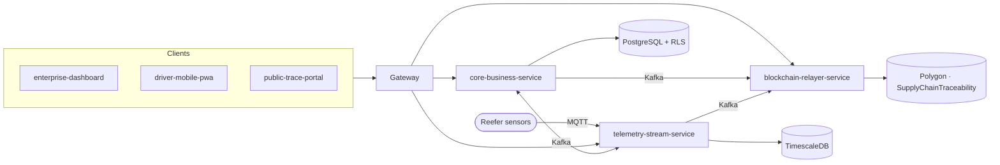

# VeriTrace

**Multi-tenant supply chain execution and GS1 traceability, with real-time cold-chain monitoring and
blockchain-anchored verification.**

This repository is the home of the VeriTrace project. It holds the documentation, the roadmap, the
architecture decisions, and the tooling that works across all repositories of the
[`veritrace-platform`](https://github.com/veritrace-platform) organization. The runtime code lives in the
service repositories listed below.

## What VeriTrace does

Companies that do not fully trust each other (brand owners, carriers, distributors, retailers) share one
tamper-evident record of the goods they move.

| Capability | How |
| --- | --- |
| **GS1 identification** | Locations (GLN), products (GTIN), lots, and logistic units (SSCC) validated with Modulo 10 check digits and bound to each company's GS1 prefix |
| **Multi-party isolation** | PostgreSQL row-level security per company; each shipment is shared only with its owner, carrier, and consignee |
| **Custody handover** | One-time pickup code, SSCC scan, and geo-fence check at origin and destination |
| **Emergency recall** | One action locks a lot across every company that holds it and alerts all of them in real time |
| **Cold-chain monitoring** | MQTT → Kafka → TimescaleDB; excursions lasting 30 s or more raise incidents within a second |
| **Tamper evidence** | Canonicalized, hash-chained shipment events; Merkle roots committed on Polygon by a gasless relayer |
| **Public verification** | Signed GS1 Digital Link labels, a provenance timeline, on-chain proofs, and cloned-label detection |

## Architecture



Read the [architecture overview](docs/architecture/overview.md) for components, data ownership, and the
main flows.

## Repositories

| Repository | Purpose | Stack |
| --- | --- | --- |
| [`veritrace`](https://github.com/veritrace-platform/veritrace) | **Start here.** Documentation, roadmap, decisions, workspace tooling | Markdown, Bash, Python |
| [`platform-infrastructure`](https://github.com/veritrace-platform/platform-infrastructure) | Local stack, database and broker bootstrap, gateway, IoT simulator, demonstration kit | Docker Compose, Caddy, Python |
| [`core-business-service`](https://github.com/veritrace-platform/core-business-service) | Tenants, identity, GS1 catalog, lots, inventory, shipments, handover, recall, document vault, public trace API | Go, PostgreSQL |
| [`telemetry-stream-service`](https://github.com/veritrace-platform/telemetry-stream-service) | Telemetry ingestion, breach detection, real-time notifications | Go, MQTT, Kafka, TimescaleDB |
| [`blockchain-relayer-service`](https://github.com/veritrace-platform/blockchain-relayer-service) | Merkle batching, gasless commits, chain indexing, proofs | Go, Redis, go-ethereum |
| [`smart-contracts`](https://github.com/veritrace-platform/smart-contracts) | On-chain commitment contract | Solidity, Foundry |
| [`enterprise-dashboard`](https://github.com/veritrace-platform/enterprise-dashboard) | Management web application | Web |
| [`driver-mobile-pwa`](https://github.com/veritrace-platform/driver-mobile-pwa) | Driver app: scanning, handover, alerts | PWA |
| [`public-trace-portal`](https://github.com/veritrace-platform/public-trace-portal) | Consumer verification portal | Web |

## Status

| Milestone | Scope | Status |
| --- | --- | --- |
| **M1 — Operational Core** | Multi-tenancy, GS1 catalog, lots and inventory, handover, recall, cold-chain monitoring | In progress |
| **M2 — Decentralized Trust** | Encrypted document vault, on-chain commitments, public verification, observability | Planned |

Story-level status is tracked in the [roadmap](docs/roadmap.md).

## Getting started

```bash
mkdir veritrace-platform && cd veritrace-platform
git clone https://github.com/veritrace-platform/veritrace.git
make -C veritrace workspace                  # clone every repository side by side
make -C platform-infrastructure up-apps      # local stack plus the Go services
make -C platform-infrastructure ps           # every container healthy
make -C platform-infrastructure seed demo    # demo companies, then the M1 acceptance run
```

The [development setup guide](docs/guides/development-setup.md) covers prerequisites, ports, and the
backend and frontend workflows.

## Documentation

| | |
| --- | --- |
| **Architecture** | [Overview](docs/architecture/overview.md) · [Data model](docs/architecture/data-model.md) · [Security](docs/architecture/security.md) · [External services and cost](docs/architecture/external-services.md) |
| **Domain** | [Glossary](docs/glossary.md) · [GS1 identifiers](docs/domain/gs1-identifiers.md) · [Shipment lifecycle](docs/domain/shipment-lifecycle.md) · [Access control](docs/domain/access-control.md) · [Cold-chain monitoring](docs/domain/cold-chain-monitoring.md) · [Public verification](docs/domain/public-verification.md) |
| **Contracts** | [REST API](docs/contracts/rest-api.md) · [Messaging](docs/contracts/messaging.md) · [Smart contract](docs/contracts/smart-contract.md) · [Test vectors](docs/contracts/test-vectors/) |
| **Decisions** | [Architecture decision records](docs/adr/README.md) |
| **Frontends** | [Conventions](docs/frontend/README.md) · [Dashboard](docs/frontend/enterprise-dashboard.md) · [Driver PWA](docs/frontend/driver-mobile-pwa.md) · [Public portal](docs/frontend/public-trace-portal.md) |
| **Guides** | [Development setup](docs/guides/development-setup.md) · [Engineering workflow](docs/guides/engineering-workflow.md) · [Coding standards](docs/guides/coding-standards.md) · [Frontend integration](docs/guides/frontend-integration.md) |

## Workspace tooling

| Command | Purpose |
| --- | --- |
| `make workspace` | Clone every missing repository next to this one |
| `make status` | Branch, pending changes, and upstream divergence of every repository |
| `make check-docs` | Check links and anchors in this repository |
| `make check-workspace` | Check links from other repositories into these docs, and shared Go platform drift |
| `make check-all` | Run the checks of every backend repository (lint, generated code, all tests), then `check-workspace` |
| `make github-settings` | Preview the repository settings (description, topics, merge rules, branch protection); apply with `scripts/github-settings.sh --apply` |

## Contributing

See the organization [contributing guide](https://github.com/veritrace-platform/.github/blob/main/CONTRIBUTING.md)
and the [engineering workflow](docs/guides/engineering-workflow.md).

## License

[MIT](LICENSE)
