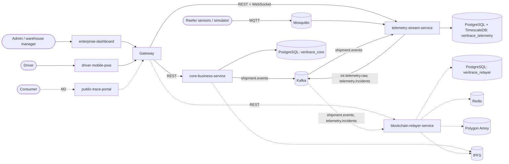
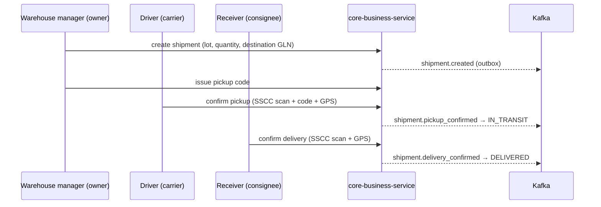
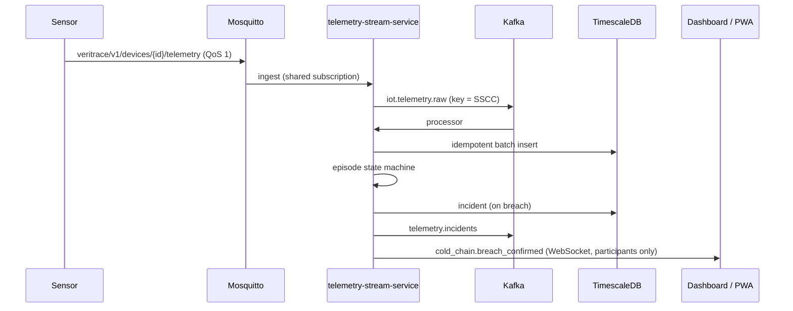

# Architecture Overview

## 1. Purpose

VeriTrace is a multi-tenant supply chain execution and traceability platform. Companies that do not fully
trust each other (brand owners, carriers, distributors, and retailers) share one operational record of
the goods moving between them. The record is identified with GS1 keys, monitored by cold-chain sensors,
and in M2 anchored on a public blockchain.

| Milestone | Scope |
| --- | --- |
| **M1 — Operational Core** | Multi-tenant WMS/TMS, GS1 identification, lots and inventory, custody handover, emergency recall, real-time cold-chain monitoring, tamper-evident event log |
| **M2 — Decentralized Trust** | Encrypted document vault on IPFS, Merkle commitments on Polygon through a gasless relayer, signed consumer labels, public trace portal, observability stack, cloud deployment |

## 2. System context

Dashed elements arrive in M2.

## 3. Components

| Component | Responsibility | Owns |
| --- | --- | --- |
| Gateway (Caddy) | Single origin for clients: TLS, routing, WebSocket upgrade | — |
| `core-business-service` | Tenants, users, auth (JWT issuer), access policy, GS1 catalog, lots, inventory, shipments, handover, recall, event log and outbox. M2: document vault, labels, public trace API. | `veritrace_core` |
| `telemetry-stream-service` | MQTT ingestion, reading persistence, breach detection, shipment projection, WebSocket notification hub, telemetry read API | `veritrace_telemetry` |
| `blockchain-relayer-service` (M2) | Leaf collection, Merkle batching, nonce-safe gasless commits, chain indexing, proof API | `veritrace_relayer`, Redis |
| `smart-contracts` (M2) | `SupplyChainTraceability` commitment contract | chain state |
| `platform-infrastructure` | Compose environment, bootstrap, gateway configuration, IoT simulator | — |
| `veritrace` | Project home: documentation, roadmap, decisions, workspace tooling | — |
| Frontends | Dashboard, driver PWA, public portal | — |

Services never read each other's databases ([ADR-0003](../adr/0003-service-owned-databases-and-migrations.md)).
They integrate through REST behind the gateway and through Kafka events
([ADR-0011](../adr/0011-messaging-topology.md)).

## 4. Tenancy

- Master data belongs to one tenant.
- Shipments are shared with their participants (owner, carrier, consignee, and in M2 inspector).
- Lots are visible to their owner and to the tenants that hold their stock.
- PostgreSQL row-level security enforces all three rules
  ([ADR-0002](../adr/0002-multi-party-tenancy-with-row-level-security.md)), and a per-action policy
  governs what users may do ([ADR-0009](../adr/0009-access-control-policy-model.md)).

## 5. Key flows

### 5.1 Shipment lifecycle

Every transition appends a hash-chained event in the same transaction as the state change, and the outbox
publishes it ([ADR-0005](../adr/0005-transactional-outbox-for-domain-events.md),
[ADR-0006](../adr/0006-tamper-evident-event-hashing.md)). The business rules are in
[shipment-lifecycle.md](../domain/shipment-lifecycle.md).

### 5.2 Cold-chain telemetry

The rules are in [cold-chain-monitoring.md](../domain/cold-chain-monitoring.md), and the engine design is
in [ADR-0012](../adr/0012-cold-chain-detection-engine.md).

### 5.3 Emergency recall

The lot owner's admin recalls a lot. In one transaction, the lot and every affected shipment across all
tenants become `RECALLED`, and each emits `shipment.recalled`. The hub pushes the alert to every
participant tenant. In M2, the recall seals an on-chain batch immediately and the public portal shows a
danger banner.

### 5.4 Anchoring and public verification (M2)

1. The relayer consumes event and incident hashes, seals Merkle batches, pins a manifest to IPFS, and
   commits the root through the gasless pipeline.
2. A consumer scans a signed label.
3. The portal asks the core public API for the verdict and timeline, and asks the relayer for inclusion
   proofs.

See [ADR-0014](../adr/0014-on-chain-commitments.md), [ADR-0015](../adr/0015-gasless-relayer.md), and
[ADR-0016](../adr/0016-signed-labels-and-public-verification.md).

## 6. Runtime environments

- **Local:** Docker Compose in `platform-infrastructure`
  ([ADR-0019](../adr/0019-local-development-environment.md)).
- **M2:** local mode is always available. The optional cloud mode runs the frontends on Vercel and the
  backend on a single $0 VM with the same compose topology behind Caddy
  ([ADR-0018](../adr/0018-deployment-topology.md), [external-services.md](external-services.md)).

## 7. Cross-cutting concerns

| Concern | Where |
| --- | --- |
| Authentication | [ADR-0007](../adr/0007-token-authentication-with-eddsa-and-jwks.md) |
| API conventions and errors | [ADR-0010](../adr/0010-rest-api-style-and-error-model.md), [rest-api.md](../contracts/rest-api.md) |
| Security and cryptography | [security.md](security.md) |
| Observability | [ADR-0017](../adr/0017-observability.md) |
| Data model | [data-model.md](data-model.md) |
