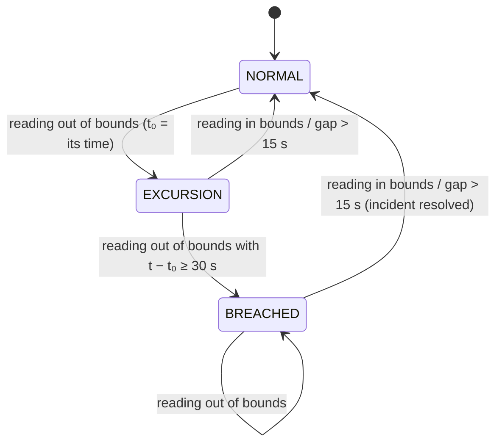

# Cold-Chain Monitoring

## 1. Inputs

- **Readings:** sensors (reefer data loggers) publish readings for the SSCC they are attached to, every
  5 seconds by default. A reading has a device timestamp, temperature (°C), relative humidity (%), and
  position.
- **Bounds:** `[T_min, T_max]`, taken from the shipment's product snapshot at creation time. Later changes
  to the product do not affect shipments that already exist.

## 2. Reading validation

A reading is rejected (counted and logged, but not stored) if any of the following holds:

- The SSCC is not a valid SSCC-18.
- Temperature is outside −50…80 °C, humidity is outside 0…100 %, or the coordinates are out of range.
- The device timestamp is more than 5 minutes in the future or more than 24 hours in the past, relative to
  the time the message was received.

Duplicate readings (same SSCC, device, and timestamp) are stored once.

## 3. Evaluation scope

- Readings are evaluated only for shipments that the telemetry service knows (through its shipment
  projection) and whose status is `CREATED` or `IN_TRANSIT`.
- Readings for unknown or finished shipments are stored but not evaluated.

## 4. Breach rule

The bounds are inclusive. A reading is an **excursion** if `T < T_min` or `T > T_max`.

For each SSCC, the detector runs an episode state machine over readings in device-time order:

- **Continuity:** an episode requires consecutive out-of-bounds readings with no gap larger than
  **15 seconds** (3 × the nominal interval). A gap ends the episode, because missing data is not
  evidence of a sustained excursion. A gap that ends a `BREACHED` episode resolves its incident at the
  last reading received.
- **One incident per episode:** the transition to `BREACHED` creates exactly one incident with
  `started_at = t₀` and `confirmed_at = t`. While the episode continues, the incident tracks the extreme
  temperature. The transition back to `NORMAL` sets `ended_at` and the final duration.
- **Ordering:** a reading whose time is not after the last evaluated reading for that SSCC is stored but
  not evaluated.
- **Multiple devices:** readings from all devices on the same SSCC feed one episode stream. Readings that arrive
  together are evaluated in device-time order.
- **End of monitoring:** when the shipment becomes `DELIVERED`, `CANCELLED`, or `RECALLED`, its readings are no
  longer evaluated, so none can end an open incident. The incident is resolved at the last reading recorded
  until the status change.

## 5. On breach confirmation

Within one second of processing the confirming reading, the system:

1. Inserts the incident, together with its `incident_hash`
   ([ADR-0006](../adr/0006-tamper-evident-event-hashing.md)).
2. Produces `cold_chain.breach_confirmed` to Kafka topic `telemetry.incidents`.
3. Pushes `cold_chain.breach_confirmed` over WebSocket to every participant tenant of the shipment and to
   its assigned driver.

On resolution, `cold_chain.breach_resolved` is produced and pushed the same way.

Incidents and their events take IDs derived from the episode (its SSCC and start), so processing a reading again
never yields a second incident or a different event: a repeated event has the same `event_id`.

## 6. State recovery

- Episode state is held in memory per SSCC by the consumer that owns the SSCC's Kafka partition.
- When a partition is assigned, which happens on startup or rebalance, state for an SSCC is rebuilt lazily
  from its first new reading. The rebuild starts from the SSCC's latest incident (an open one continues the
  episode) and evaluates the SSCC's readings of the last 60 seconds again. A batch that fails also drops the
  state, so its retry rebuilds it the same way.
- Because incidents are unique per `(sscc, started_at)`, a rebuild never duplicates one. It records a
  confirmation or resolution that a failed batch did not persist, and only then produces its event.
