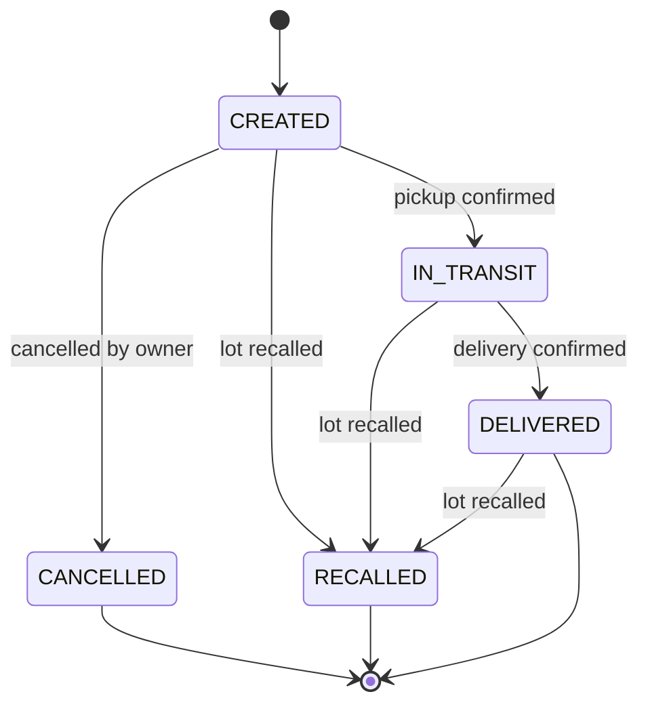

# Lots, Inventory, and Shipment Lifecycle

## 1. Concepts

| Concept | Meaning |
| --- | --- |
| **Lot** | A production batch of one product (GTIN + lot number). It is owned by the tenant that commissioned it (the brand owner). Recall operates on lots. |
| **Inventory balance** | The quantity of a lot held at a location. It is kept per `(location, lot)` and changed only through inventory movements. |
| **Shipment** | Movement of a quantity of one lot, as one logistic unit (one SSCC), from an origin location to a destination location. |
| **Participant** | A tenant involved in a shipment: `OWNER` (sender), `CARRIER` (transport), `CONSIGNEE` (receiver). M2 adds `INSPECTOR` (auditor). One tenant may hold several roles. For an in-house fleet, the owner is also the carrier. |

Goods can pass through several companies (producer → distributor → retailer). Each hop is a separate
shipment, and each hop's sender is that shipment's owner. A tenant may ship a lot that another tenant owns
if it holds stock of that lot, which it gets by receiving an earlier shipment.

## 2. Commissioning a lot

1. A warehouse manager or admin creates a lot for one of the tenant's active products. They supply the lot
   number, production date, expiration date (not earlier than the production date), quantity produced,
   and the active location where the goods were produced or stored.
2. The lot starts `ACTIVE` and copies the product's GTIN, name, and temperature bounds. The location's
   balance for the lot increases by the quantity, and a `COMMISSIONED` inventory movement is recorded.
3. `(product, lot number)` is unique.

## 3. Shipment state machine



- `CANCELLED` and `RECALLED` are terminal. `DELIVERED` is terminal except for recall.
- Any operational command on a `RECALLED` shipment is rejected with `409 SHIPMENT_RECALLED_LOCKED`.
- Any other transition that is not in the diagram is rejected with `409 INVALID_STATE_TRANSITION`.
- Every successful transition appends an event to the shipment's event log (§7) in the same transaction.

## 4. Creating a shipment

Performed by the **owner** (ADMIN or WAREHOUSE_MANAGER):

1. Input:
   - lot and quantity;
   - origin location, which must belong to the owner;
   - destination GLN, which may belong to any tenant and is resolved through the GLN directory;
   - optionally, a carrier tenant (default: the owner itself) and, if the carrier is the owner, a driver.
2. Preconditions:
   - the lot is `ACTIVE`;
   - the origin's balance for the lot is at least the quantity;
   - the destination is not the origin.
3. Effects, all in one transaction:
   - An SSCC is issued ([gs1-identifiers.md §3](gs1-identifiers.md#3-sscc-issuance)).
   - Snapshots are stored on the shipment:
     - product: GTIN, name, temperature bounds;
     - lot: number, expiration date;
     - origin and destination: GLN, name, coordinates, geo-fence radius.
   - Participants are recorded: `OWNER` = sender; `CONSIGNEE` = the tenant that owns the destination GLN;
     `CARRIER` = the chosen carrier.
   - The origin balance decreases by the quantity (movement `SHIPMENT_CREATED`).
   - Event `shipment.created`.

The quantity is allocated at creation, so two shipments cannot promise the same stock. A balance can never
go negative, because a database constraint enforces it.

## 5. Carrier and driver assignment (state `CREATED`)

- The owner may assign a carrier tenant if none other than itself was set. This emits
  `shipment.participant_added`.
- A user of the **carrier** tenant (ADMIN or WAREHOUSE_MANAGER) assigns one of its active DRIVER users.
  Reassignment is allowed while the shipment is `CREATED`. It invalidates any active pickup code and emits
  `shipment.driver_assigned`.

## 6. Custody handover protocol

### 6.1 Pickup (origin → driver): `CREATED → IN_TRANSIT`

1. **Issue pickup code** (owner, ADMIN or WAREHOUSE_MANAGER; a driver must be assigned):
   - The system generates a 6-digit code with a CSPRNG and stores only
     `HMAC-SHA256(pepper, shipment_id ‖ code)`.
   - The code is valid for **15 minutes** and allows **5 attempts**.
   - Issuing a new code invalidates the previous one.
   - The plaintext code is returned once, to be handed to the driver in person at the dock.
2. **Confirm pickup** (the assigned driver, from the PWA):
   - The driver submits the **scanned SSCC**, the code, and the device position (latitude, longitude,
     accuracy).
   - Checks, in order:
     1. the shipment is not recalled;
     2. the state is `CREATED`;
     3. the caller is the assigned driver;
     4. the scanned SSCC equals the shipment's SSCC (`SSCC_MISMATCH`);
     5. the code exists, is unexpired and not locked (`PICKUP_CODE_EXPIRED`, `PICKUP_CODE_LOCKED`);
     6. the code matches (`PICKUP_CODE_INVALID`, which consumes an attempt);
     7. the position is inside the origin geo-fence (`OUTSIDE_GEOFENCE`).
   - On success, the code is consumed, the state becomes `IN_TRANSIT`, and event
     `shipment.pickup_confirmed` records the position and the computed distance.

### 6.2 Transit checkpoint (optional): state stays `IN_TRANSIT`

The assigned driver scans the SSCC at an intermediate facility, identified by GLN, while inside that
facility's geo-fence. This emits `shipment.checkpoint_recorded`.

### 6.3 Delivery (driver → destination): `IN_TRANSIT → DELIVERED`

- A user of the **consignee** tenant (ADMIN or WAREHOUSE_MANAGER) scans the SSCC at the destination.
- Checks: the shipment is not recalled; the state is `IN_TRANSIT`; the scanned SSCC matches; the position
  is inside the destination geo-fence.
- Effects:
  - the state becomes `DELIVERED`;
  - the destination balance for the lot increases (movement `SHIPMENT_DELIVERED`, recorded under the
    consignee tenant);
  - event `shipment.delivery_confirmed`.

The three parties are therefore origin (issues the code), driver (proves presence and possession), and
destination (confirms receipt).

### 6.4 Geo-fence rule

```
distance = haversine(device, facility)          // R = 6 371 000 m
inside  ⇔ distance ≤ facility.geo_fence_radius_meters + min(device.accuracy_meters, 50)
```

The radius is 50–5000 m (default 200 m). Positions are recorded in the event payload for audit. Device GPS
is client-reported and is treated as evidence; the pickup code is the control that matters.

## 7. Cancellation: `CREATED → CANCELLED`

The owner (ADMIN or WAREHOUSE_MANAGER) cancels a shipment that has not been picked up, and gives a reason.
The allocated quantity returns to the origin balance (movement `SHIPMENT_CANCELLED`). The SSCC is retired
and never reused. Event `shipment.cancelled`.

## 8. Emergency recall

- **Who:** an ADMIN of the tenant that owns the lot.
- **Input:** the lot and a reason (required).
- **Effects, in one transaction:**
  1. The lot becomes `RECALLED` and a recall record is stored. New shipments of the lot are rejected with
     `409 LOT_RECALLED`.
  2. Every shipment of the lot in state `CREATED`, `IN_TRANSIT`, or `DELIVERED` becomes `RECALLED`,
     **across all tenants** (including downstream hops). Each one emits `shipment.recalled` with the
     recall ID, reason, and previous status.
  3. Balances are not changed. The stock physically stays where it is and is quarantined through the lot
     status.
- **Notification:** the real-time hub pushes `shipment.recalled` to every participant tenant of every
  affected shipment. These are exactly the tenants that hold or held the goods.
- **M2:** recall events trigger an immediate on-chain commitment instead of waiting for the next batch
  window. The public portal shows a danger banner for the lot.

## 9. Shipment event log

- Every shipment has an append-only, hash-chained log
  ([ADR-0006](../adr/0006-tamper-evident-event-hashing.md)).
- Events are numbered `sequence = 1, 2, …` per shipment.
- The log is the audit trail shown to participants, the source of the Kafka `shipment.events` stream, and
  the Merkle leaf source in M2.

| Event type | Emitted when | Resulting status |
| --- | --- | --- |
| `shipment.created` | §4 | `CREATED` |
| `shipment.participant_added` | Carrier assigned (§5), inspector added (M2) | unchanged |
| `shipment.driver_assigned` | §5 | unchanged |
| `shipment.pickup_confirmed` | §6.1 | `IN_TRANSIT` |
| `shipment.checkpoint_recorded` | §6.2 | unchanged |
| `shipment.delivery_confirmed` | §6.3 | `DELIVERED` |
| `shipment.cancelled` | §7 | `CANCELLED` |
| `shipment.recalled` | §8 | `RECALLED` |
| `shipment.document_attached` | Document uploaded (M2) | unchanged |

The exact payload of each event is defined in
[contracts/messaging.md](../contracts/messaging.md#3-kafka-topic-shipmentevents).
